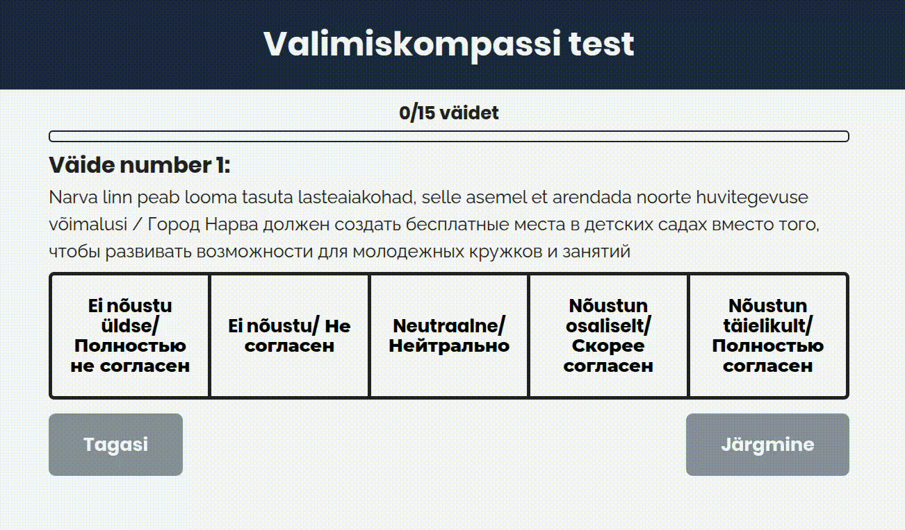
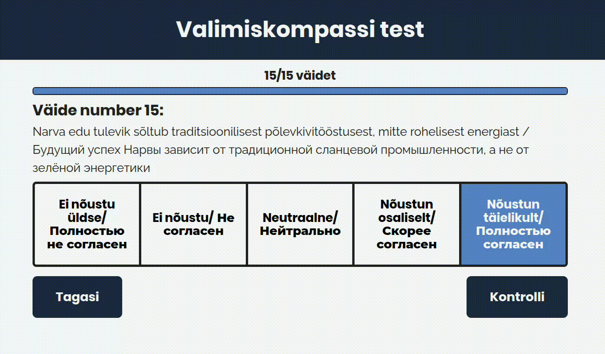

# Narva Valimiskompass

**Narva Valimiskompass** is a web application that helps Narva residents find local election candidates whose views match the user’s answers most closely.  
The project is non-profit and independent, with a strong focus on transparency and privacy.

---
## Link to site

[narva-valimiskompass.online](https://narva-valimiskompass.online/)

## Showcase

### 1. Questionnaire Flow

### 2. Results and Match Percentages

### 3. Share View

---

## Project Structure

### `backend/`

Node.js / Express server that:

* calculates match percentages,
* stores results in MongoDB,
* provides REST API endpoints.

### `frontend/`

React + TypeScript client application that:

* displays questions and candidate profiles,
* calculates results in real time,
* allows users to share results.

### `wasm/`

A Rust library compiled to WebAssembly.  
Contains a performant function for calculating similarity between user and candidate answers.

---
